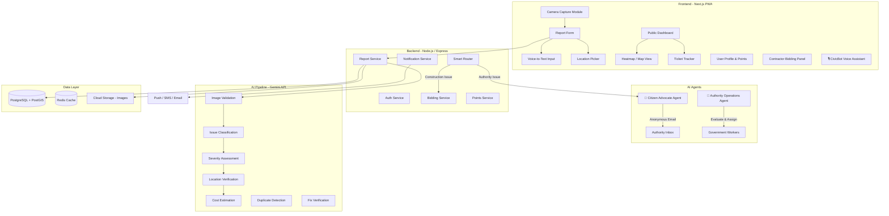
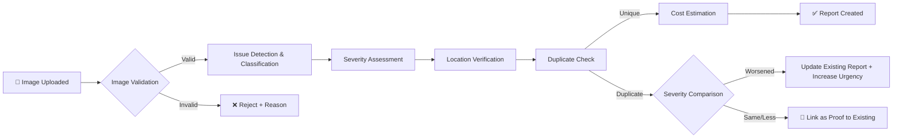
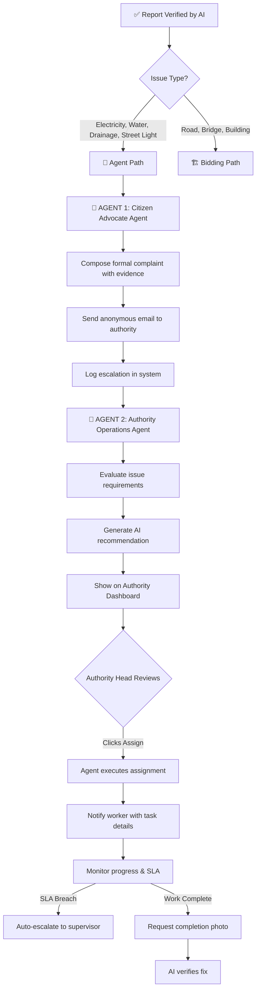
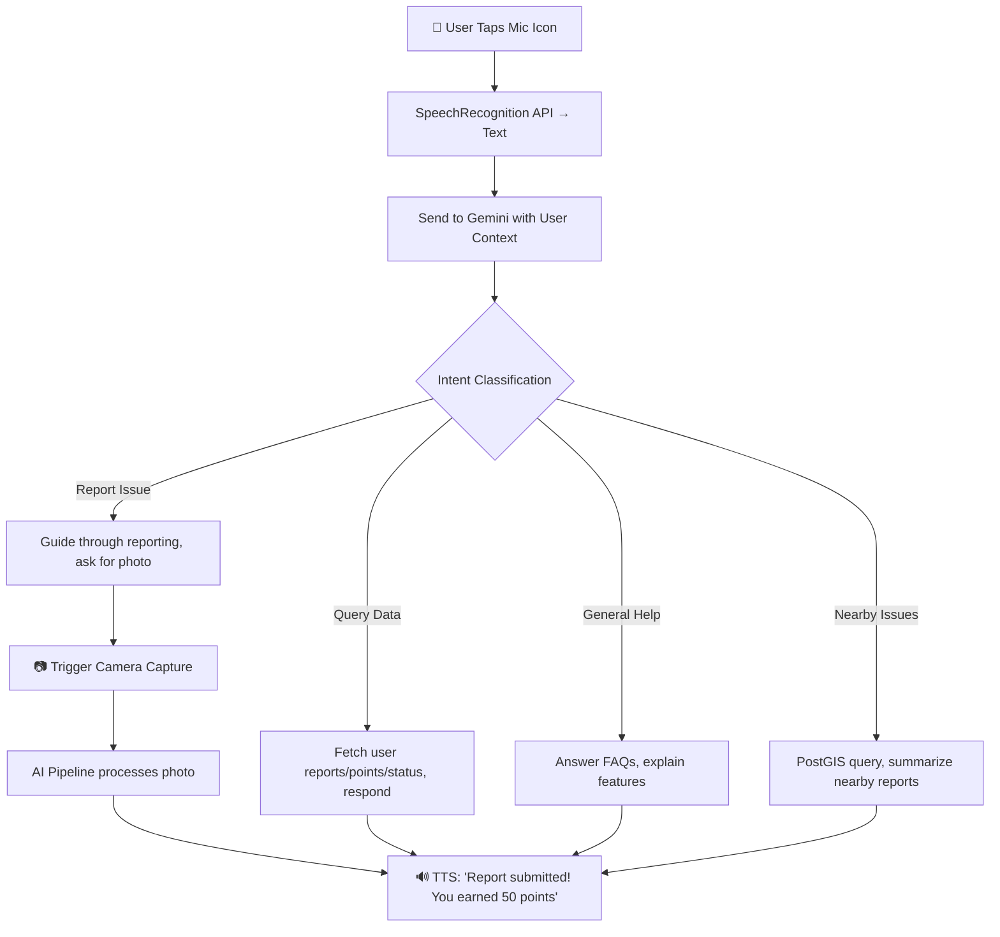

# 🏗️ Civic AI — Implementation Plan

> **An AI-powered civic infrastructure reporting platform** where citizens capture live evidence of issues, AI validates and classifies them, and a **hybrid smart system** either auto-dispatches government workers via AI agents (for authority-managed issues like electricity, water, drainage) or opens transparent contractor bidding (for construction-heavy issues like road, bridge, building repairs).

---

## 📐 System Architecture Overview



---

## 🛠️ Tech Stack

| Layer | Technology | Rationale |
|-------|-----------|-----------|
| **Frontend** | Next.js 14 (App Router) + TypeScript | SSR/SSG, API routes, React ecosystem |
| **Styling** | Tailwind CSS + shadcn/ui | Rapid premium UI development |
| **State** | Zustand | Lightweight, scalable state management |
| **Maps** | Leaflet + OpenStreetMap | Free, no API key limits for map tiles |
| **Geocoding** | Google Maps Geocoding API | Reverse geocoding & street view verification |
| **Camera** | Native MediaDevices API | Direct camera access, no gallery uploads |
| **Voice** | Web Speech API | Browser-native voice-to-text & text-to-speech |
| **AI Assistant** | Gemini 2.0 Flash + Web Speech API | Live conversational voice assistant with user context |
| **Backend** | Node.js + Express.js | REST API, middleware ecosystem |
| **Database** | PostgreSQL + PostGIS | Geospatial queries, robust relational DB |
| **Cache** | Redis | Session cache, rate limiting, leaderboards |
| **AI/ML** | Google Gemini 2.0 Flash | Image analysis, classification, cost estimation |
| **AI Agents** | Gemini + Nodemailer + Cron Jobs | Autonomous agents for escalation & worker assignment |
| **Storage** | Cloudinary or AWS S3 | Image hosting with on-the-fly transforms |
| **Auth** | JWT + bcrypt (+ Google OAuth) | Secure, flexible authentication |
| **Notifications** | Firebase Cloud Messaging + Nodemailer | Push notifications + email alerts |
| **Deployment** | Vercel (FE) + Railway/Render (BE) | Affordable, scalable hosting |
| **Mobile (Later)** | Capacitor | Wrap PWA as native Android/iOS app |

---

## 📱 Mobile Strategy: PWA First → Capacitor Later

| Phase | Approach | Details |
|-------|----------|---------|
| **Phase 5** | **PWA (Progressive Web App)** | Installable from browser on Android & iOS, offline support, push notifications, camera/GPS access |
| **Phase 6** | **Capacitor (Native Shell)** | Wrap the PWA in a native container for Google Play Store & Apple App Store listing |

**Design Principle**: Mobile-first UI throughout — bottom navigation bar, touch-friendly targets, swipe gestures. Since most civic reporters will use phones, every screen is designed for small screens first.

---

## 📦 Module Breakdown

### Module 1: Authentication & User Management
| Feature | Description |
|---------|-------------|
| Sign Up / Login | Email + password, Google OAuth (Required for Officials/Contractors; Optional for Citizens) |
| Role-Based Access | `citizen` (optional), `official`, `contractor`, `worker`, `admin` |
| Profile Management | Edit profile, view points, report history (if logged in) |
| Anonymous Mode | Default for new citizens. Immediate reporting without account creation. |

**Strict Role-Based Section Access:**
| Role | Can Access | Cannot Access |
|------|-----------|---------------|
| 🏠 Citizen | Report form (no auth required), Public Dashboard, Ticket Tracker. If logged in: My Reports, Profile, Points | Authority Dashboard, Worker Panel, Admin |
| 🏛️ Official (Authority Head) | Authority Dashboard, Issue Queue, AI Recommendations, Resource Mgmt, Analytics | Citizen report form, Worker task panel |
| 👷 Worker | My Tasks, Check-in, Complete Task, Profile | Authority Dashboard, Citizen sections |
| 🏗️ Contractor | Available Bids, My Bids, Completed Projects | Authority Dashboard, Worker panel |
| 🔑 Admin | Everything | — |

> [!IMPORTANT]
> Protection is enforced at **both layers**: frontend route guards (redirect unauthorized roles) AND backend API middleware. Citizens do not need to log in to access the Report Form and Public heatmaps. Other sections require strict JWT validation.

---

### Module 2: Camera-First Evidence Capture
| Feature | Description |
|---------|-------------|
| **Inline Camera Viewfinder** | Uses `MediaDevices.getUserMedia()` to render a live `<video>` stream **directly inside the webpage** — the camera view is embedded in the page, NOT launching the native camera app or file picker |
| **Canvas Photo Capture** | On shutter press, draw the current video frame to a `<canvas>`, export as JPEG/PNG blob — no `<input type="file">` at any point |
| **Front / Rear Toggle** | Switch between `facingMode: "environment"` (rear) and `"user"` (front) cameras |
| **Flash Control** | Use `ImageCapture` API + `MediaStreamTrack.applyConstraints({ torch: true })` for flashlight on supported devices |
| **Multi-Photo Support** | Capture up to 10 photos per report, shown as scrollable thumbnails below the viewfinder |
| **Photo Preview** | Tap any thumbnail to full-screen preview with retake / delete options |
| EXIF Metadata | Extract timestamp + GPS coordinates at capture time via `navigator.geolocation` |
| **"Quick Sweep" Video** | For complex issues (Roads/Bridges), prompts user to record a quick 5-second, 180° pan (instead of a full 360) so AI can estimate volume/cost easier. |
| Freshness Check | AI verifies capture timestamp to ensure recency |
| AI Scan Overlay | Cyan corner brackets + scan line animation overlaid on the viewfinder while AI is analyzing |
| **Real-time Safety Warnings** | If AI instantly detects a severe hazard in the live viewfinder (e.g., exposed sparking wire), it overlays a bold warning: "⚠️ DANGER DETECTED: Step back 10 feet" |

> [!IMPORTANT]
> The camera module must **NEVER** launch the native camera app or file picker. All camera interaction happens **inline within the webpage** using WebRTC (`getUserMedia` → `<video>` → `<canvas>` capture). Gallery/file uploads are completely blocked. This approach works on both mobile browsers and desktop.

> [!NOTE]
> On Capacitor (native app), we replace WebRTC with `@capacitor/camera` plugin for better native performance, but the UX remains the same — inline viewfinder, no app switching.

---

### Module 3: Report Submission & AI Processing
| Feature | Description |
|---------|-------------|
| **Proximity Duplicate Alert** | While waiting for location lock, checks DB for issues within 50m. Pops up: *"Similar issue reported nearby. Is this the Pothole on Market St?"* to save user time. |
| **Active AI Chat Assistant** | A floating action button (FAB) that opens a conversational interface. If a user is unsure what to report or how to capture evidence, they can chat or talk to the AI (powered by Sarvam AI for multiple Indian languages), which guides them step-by-step and autofills the form for them. |
| Text Description | Standard text input for issue details |
| **Voice-to-Text (Sarvam AI)** | Speech recognition specifically tailored for regional Indian languages (Hindi, Tamil, Telugu, etc.) using Sarvam AI integration. |
| **Tone Analysis** | If voice recording is used, Gemini analyzes emotional tone (e.g., panicked). Panicked audio instantly bumps the issue to CRITICAL severity. |
| Location Auto-Detect | GPS auto-fill with manual map-pin adjustment |
| Category Dropdown | Explicit dropdown menu for related problems (Road, Water, Electricity, Infrastructure, Physical Structure, etc.). Selected by user, verified and saved by AI. |
| Optional Contact Info | An optional input for unauthenticated users to provide an email or phone number to receive future updates about their specific report. |
| AI Processing Pipeline | Runs on submission (see AI Pipeline section below) |

---

### Module 4: AI Validation & Processing Pipeline



| Stage | AI Task | Details |
|-------|---------|---------|
| **1. Image Validation** | Verify the image shows a real infrastructure issue | Reject irrelevant images (selfies, food, etc.) with a reason |
| **2. Issue Classification** | Detect issue type | Categories: Pothole, Broken Road, Water Leak, Damaged Bridge, Exposed Wiring, Blocked Drain, Building Damage, Street Light, etc. |
| **3. Severity Assessment** | Rate severity: `Low`, `Medium`, `High`, `Critical` | Based on size, danger level, traffic impact |
| **4. Location Verification** | Cross-check GPS with Google Street View | Compare surroundings to verify the user is actually at the reported location |
| **5. Duplicate Detection & Escalation** | Check for existing reports within 200m radius | Uses PostGIS `ST_DWithin`. If a duplicate exists, the AI compares the new photo to the old photo. If the issue has worsened (increased severity), it updates the existing ticket's urgency, SLA, and evidence. Otherwise, it just links the new photo as additional proof. |
| **6. Cost Estimation** | Estimate repair cost range | Based on issue type, severity, and regional cost data; generates a hidden base price |

> [!NOTE]
> All AI processing uses **Gemini 2.0 Flash** with structured JSON output prompts. Each stage has a specific prompt template stored in the backend.

---

### Module 5: Smart Routing & Hybrid Workflow Engine

The system intelligently decides the workflow path based on issue type:

| Issue Category | Workflow Path | Rationale |
|----------------|--------------|----------|
| Pothole, Broken Road, Bridge Damage, Building Damage | **🏗️ Bidding Path** | Needs external contractors for reconstruction |
| Electricity, Street Light, Water Leak, Blocked Drain, Sewage | **🤖 Agent Automation Path** | Handled by government authority workers |

**Common Features (both paths):**
| Feature | Description |
|---------|-------------|
| Jurisdiction Detection | Auto-determine authority (NHAI, PWD, Municipal Corp, Electricity Board, Water Board) from location + issue type |
| Road/Area Classification | OSM data + GPS to classify ownership |
| Department Mapping | DB mapping: `issue_type` × `state` × `district` → `department` |
| SLA Tracking | Auto-escalation if unresolved within deadline |

**SLA Tiers:**
| Severity | Initial Response | Resolution Target |
|----------|-----------------|-------------------|
| Critical | 2 hours | 48 hours |
| High | 12 hours | 7 days |
| Medium | 24 hours | 14 days |
| Low | 48 hours | 30 days |

---

### Module 6: 🤖 AI Agent Automation System (for Authority-Handled Issues)

For issues like electricity faults, water leaks, street lights, drainage — handled entirely by government workers, not external contractors.



#### 🤖 Agent 1: Citizen Advocate Agent

| Capability | Details |
|------------|--------|
| **Trigger** | Fires automatically when a verified report is routed to the Agent Path |
| **Compose Complaint** | Uses Gemini to draft a formal complaint letter with issue details, location, photos, severity, and estimated impact |
| **Anonymous Submission** | Sends the complaint via anonymous email (using a system `noreply@civicai.in` address) to the relevant authority's official email |
| **Multi-Channel** | Can also submit to government grievance portals (e.g., CPGRAMS API), or generate a formal letter PDF |
| **Follow-Up** | Auto-sends follow-up emails if no response within SLA deadline |
| **Audit Trail** | Logs every communication (email sent, timestamp, authority contacted) for transparency |

#### 🤖 Agent 2: Authority Operations Agent (Recommends → Authority Approves)

| Capability | Details |
|------------|--------|
| **Trigger** | Fires after Agent 1 completes or when an official acknowledges the issue |
| **Issue Evaluation** | Uses Gemini to analyze what resources/skills are needed (e.g., electrician for power line, plumber for water main) |
| **Worker Matching** | Queries available workers by skill type, proximity (PostGIS), and current workload |
| **AI Recommendation** | Generates a recommendation card: "Assign Electrician Ramesh (2km away, available, 4.8★)" — shown on Authority Dashboard |
| **Authority Approval** | Authority head reviews recommendation and clicks **"Assign"** → Agent executes the assignment |
| **Resource Estimation** | Estimates materials/equipment/vehicles needed based on issue type and severity |
| **Progress Monitoring** | Tracks worker check-in (GPS), work duration, and completion status |
| **Escalation** | Auto-escalates to supervisor if worker doesn't respond within 1 hour or SLA is at risk |
| **Completion Verification** | When worker submits completion photo → triggers AI fix verification |

---

### Module 7: 🏛️ Authority Dashboard (Role-Protected)

A dedicated dashboard for department heads (e.g., Electricity Board Head, Municipal Commissioner) to manage their jurisdiction.

| Feature | Description |
|---------|-------------|
| **Global Filters** | Mandatory dropdown menus for **State**, **District**, and **Problem Category** (Road, Water, Electricity, etc.) to filter the entire dashboard view. |
| **Issue Queue** | All reported issues in their jurisdiction, sorted by severity/SLA urgency, with AI analysis, photos, and location |
| **AI Recommendations** | Agent 2 suggestions: recommended worker, skill match, proximity, estimated time — authority clicks "Assign" to confirm |
| **Resource Overview** | Dashboard showing: total workers (e.g., 20), available workers, vehicles (e.g., 5), current assignments, workload distribution |
| **Worker Management** | View all workers, their skills, availability, current tasks, ratings, and location on map |
| **Vehicle Tracking** | Assign vehicles to tasks, track availability |
| **One-Click Assign** | Authority reviews AI recommendation → clicks "Assign" → Agent sends task to worker with full details |
| **Bulk Actions** | Assign multiple issues at once during high-volume periods |
| **Analytics** | Resolution rate, avg response time, SLA compliance, worker performance, issue trends |
| **SLA Alerts** | Real-time alerts for at-risk or breached SLA deadlines |

---

### Module 8: 🏗️ Contractor Bidding System (for Construction Issues)

For issues requiring external contractors — road repairs, bridge reconstruction, building damage.

| Feature | Description |
|---------|-------------|
| Hidden Base Price | AI-estimated cost is hidden from contractors; used as benchmark |
| Bid Submission | Verified contractors place bids with cost + timeline |
| Bid Comparison | Officials compare bids; system highlights bids near/below base price |
| Transparency Score | Bid history + completion rate visible to officials |
| Work Assignment | Official awards contract; contractor gets notification |
| Before/After Verification | Contractor submits completion photos → AI verifies the fix |

---

### Module 9: Points & Reputation System

| Action | Points |
|--------|--------|
| Submit a report | +10 |
| Report verified by AI | +15 |
| Report resolved | +25 |
| Upvoted by others | +5 per upvote |
| Flagged as spam/false | -20 |
| Monthly streak (5+ reports) | +50 bonus |

**Levels:**
| Level | Points Required | Badge |
|-------|----------------|-------|
| Newcomer | 0 | 🌱 |
| Active Citizen | 100 | 🏅 |
| Community Champion | 500 | 🏆 |
| Civic Hero | 2000 | ⭐ |
| Legend | 5000 | 👑 |

---

### Module 10: Public Transparency Dashboard

| Feature | Description |
|---------|-------------|
| **Toggled Tab View** | Two distinct tabs on the dashboard: **"Active Issues"** and **"Resolved Issues"**. This keeps the primary view focused strictly on un-fixed problems, while archiving fixed issues cleanly in the second tab. |
| Heatmap View | Leaflet map with color-coded pins (Red = Critical, Orange = High, Yellow = Medium, Green = Resolved) |
| Global Filters | Cascading dropdown menus for **State**, **District**, and **Problem Category** to filter by location and related problems. |
| **City Health Score** | A live 0-100 score for the selected District that drops for SLA breaches and rises for swift resolutions, creating gamified accountability. |
| KPI Cards | Total reports, resolution rate, avg resolution time, active issues |
| **Follow an Issue** | Citizens can "Follow" any pin on the map to receive push notifications on its repair progress, without having reported it themselves. |
| Workflow Tracker | A highly detailed public ticket tracking view. For any given issue, a citizen sees the complete pipeline workflow (Submitted → AI Validated → Accepted/Rejected by Authority → Worker Assigned → Fixed → AI Verified) with timestamps and reasons (especially if rejected). |
| **Before & After Sliders** | In the "Resolved Issues" tab, citizens can use an interactive drag slider to visually compare the original damage photo with the AI-verified repair photo. |
| Agent Activity Log | Public view of automated actions taken (anonymized) |
| **"Local Heroes" Leaderboard** | Highlights the top 3 Government Workers/Contractors of the month in that district to boost morale. |

---

### Module 11: Notification System

| Trigger | Channel | Recipient |
|---------|---------|-----------|
| Report submitted | Push + Email | Citizen |
| AI processing complete | Push | Citizen |
| Agent 1 sent complaint to authority | Push | Citizen |
| Worker auto-assigned (Agent 2) | Push + Email | Worker |
| Report assigned to dept | Push + Email | Official |
| Bid received (construction issues) | Push | Official |
| Contract awarded | Push + Email | Contractor |
| Worker check-in / progress update | Push | Citizen |
| Status update | Push | Citizen |
| SLA breach | Push + Email + SMS | Official + Supervisor |
| Issue resolved + AI verified | Push + Email | Citizen |

---

### Module 12: 🎙️ Live AI Voice Assistant ("CivicBot")

A conversational AI assistant accessible via a floating icon on all citizen pages. Users can speak naturally about issues, ask questions about their data, and the assistant talks back with voice responses. Photo/video evidence is still required for verification.



| Feature | Description |
|---------|-------------|
| **Voice Input** | Web Speech API (`SpeechRecognition`) for browser-native speech-to-text, supports Hindi + English |
| **Voice Output** | Web Speech API (`SpeechSynthesis`) or Google Cloud TTS for natural-sounding responses |
| **AI Brain** | Gemini 2.0 Flash with a system prompt injected with the user's live context (profile, reports, points, nearby issues) |
| **Floating Icon** | Pulsing cyan/purple mic button visible on all citizen pages (dashboard, reports, map, profile) |
| **Bottom Sheet UI** | Tap icon → slides up a voice panel with waveform animation, live transcript, AI response text, and action buttons |
| **Photo/Video Trigger** | When reporting, the assistant prompts the user to take a photo — opens camera module inline |
| **Context Awareness** | Knows: user profile, all reports + statuses, points/level/badges, nearby issues (PostGIS), notification history |
| **Quick Actions** | Pill shortcuts: "My Reports", "My Points", "Nearby Issues", "Report Issue" |
| **Text Fallback** | Keyboard icon for users who prefer typing over voice |
| **Conversation Memory** | Maintains context within a session (multi-turn conversation) |

**User Context Injected into Gemini System Prompt:**
```
You are CivicBot, the AI assistant for CivicAI. You are helping {user.name}, 
a {user.level} with {user.points} Civic Points.

Their recent reports: {reports_summary}
Their current location: {gps_coords}
Nearby open issues: {nearby_issues}
Their notification history: {recent_notifications}

You can help them: report issues (but always require photo evidence), 
check report statuses, explain civic points, find nearby issues, 
and answer questions about the platform. Be friendly, concise, and helpful.
Respond in the same language the user speaks (Hindi or English).
```

**Supported Intents:**
| Intent | Example User Input | Bot Response |
|--------|-------------------|--------------|
| Report Issue | "There's a pothole on my road" | Guides through photo → location → submission |
| Check Status | "What happened to my last report?" | Fetches latest report status + timeline |
| My Points | "How many points do I have?" | Shows points, level, next milestone |
| Nearby Issues | "Are there any issues near me?" | PostGIS query within 500m, summarizes |
| Leaderboard | "What's my rank?" | Shows rank + points needed for next level |
| Help / FAQ | "How does AI verification work?" | Explains the feature conversationally |
| Escalate | "My report has been pending for 2 weeks" | Checks SLA, offers to escalate |

---

## 🗄️ Database Schema (PostgreSQL + PostGIS)

### Core Tables

```sql
-- Users table
CREATE TABLE users (
    id UUID PRIMARY KEY DEFAULT gen_random_uuid(),
    email VARCHAR(255) UNIQUE NOT NULL,
    password_hash VARCHAR(255),
    name VARCHAR(100) NOT NULL,
    phone VARCHAR(15),
    role ENUM('citizen', 'official', 'contractor', 'admin') DEFAULT 'citizen',
    avatar_url TEXT,
    points INTEGER DEFAULT 0,
    level VARCHAR(50) DEFAULT 'Newcomer',
    auth_provider VARCHAR(20) DEFAULT 'local', -- 'local' | 'google'
    is_anonymous BOOLEAN DEFAULT FALSE,
    created_at TIMESTAMP DEFAULT NOW(),
    updated_at TIMESTAMP DEFAULT NOW()
);

-- Reports table
CREATE TABLE reports (
    id UUID PRIMARY KEY DEFAULT gen_random_uuid(),
    tracking_id VARCHAR(12) UNIQUE NOT NULL, -- e.g., "CIV-2026-A3X9"
    user_id UUID REFERENCES users(id),
    title VARCHAR(200),
    description TEXT,
    input_method VARCHAR(20) DEFAULT 'text', -- 'text' | 'voice'
    category VARCHAR(50), -- AI-detected, user-editable
    severity VARCHAR(20), -- 'Low' | 'Medium' | 'High' | 'Critical'
    status VARCHAR(30) DEFAULT 'Submitted',
    -- Status flow: Submitted → AI Processing → Verified → Routed → [Agent Path / Bidding Path] → In Progress → Fixed → AI Verified → Closed
    workflow_path VARCHAR(20), -- 'agent' | 'bidding' — determined by smart router
    location GEOGRAPHY(POINT, 4326) NOT NULL,
    address TEXT,
    state VARCHAR(100),
    district VARCHAR(100),
    pincode VARCHAR(6),
    road_type VARCHAR(50), -- 'National Highway' | 'State Highway' | 'City Road' | 'Village Road'
    jurisdiction VARCHAR(100), -- 'NHAI' | 'PWD' | 'Municipal Corporation' etc.
    assigned_dept_id UUID REFERENCES departments(id),
    ai_confidence DECIMAL(5,2), -- AI classification confidence %
    ai_analysis JSONB, -- Full AI response stored
    estimated_cost_min DECIMAL(12,2),
    estimated_cost_max DECIMAL(12,2),
    base_price DECIMAL(12,2), -- Hidden from contractors
    duplicate_of UUID REFERENCES reports(id),
    sla_deadline TIMESTAMP,
    resolved_at TIMESTAMP,
    created_at TIMESTAMP DEFAULT NOW(),
    updated_at TIMESTAMP DEFAULT NOW()
);

-- Report Images
CREATE TABLE report_images (
    id UUID PRIMARY KEY DEFAULT gen_random_uuid(),
    report_id UUID REFERENCES reports(id) ON DELETE CASCADE,
    image_url TEXT NOT NULL,
    thumbnail_url TEXT,
    captured_at TIMESTAMP, -- from EXIF
    exif_gps GEOGRAPHY(POINT, 4326), -- from EXIF
    is_primary BOOLEAN DEFAULT FALSE,
    ai_validated BOOLEAN DEFAULT FALSE,
    created_at TIMESTAMP DEFAULT NOW()
);

-- Departments
CREATE TABLE departments (
    id UUID PRIMARY KEY DEFAULT gen_random_uuid(),
    name VARCHAR(200) NOT NULL,
    type VARCHAR(50), -- 'NHAI' | 'PWD' | 'Municipal' | 'Panchayat'
    state VARCHAR(100),
    district VARCHAR(100),
    contact_email VARCHAR(255),
    contact_phone VARCHAR(15)
);

-- Workers (government authority workers for agent-assigned tasks)
CREATE TABLE workers (
    id UUID PRIMARY KEY DEFAULT gen_random_uuid(),
    user_id UUID REFERENCES users(id),
    skill_type VARCHAR(50) NOT NULL, -- 'electrician' | 'plumber' | 'lineman' | 'drain_cleaner' | 'general'
    department_id UUID REFERENCES departments(id),
    is_available BOOLEAN DEFAULT TRUE,
    current_location GEOGRAPHY(POINT, 4326),
    max_concurrent_tasks INTEGER DEFAULT 3,
    active_tasks INTEGER DEFAULT 0,
    rating DECIMAL(3,2) DEFAULT 5.00,
    created_at TIMESTAMP DEFAULT NOW()
);

-- Worker Assignments (auto-assigned by Agent 2)
CREATE TABLE worker_assignments (
    id UUID PRIMARY KEY DEFAULT gen_random_uuid(),
    report_id UUID REFERENCES reports(id),
    worker_id UUID REFERENCES workers(id),
    assigned_by VARCHAR(20) DEFAULT 'agent', -- 'agent' | 'official'
    status VARCHAR(20) DEFAULT 'assigned', -- 'assigned' | 'accepted' | 'in_progress' | 'completed'
    checked_in_at TIMESTAMP,
    completed_at TIMESTAMP,
    completion_photo_url TEXT,
    ai_fix_verified BOOLEAN DEFAULT FALSE,
    notes TEXT,
    created_at TIMESTAMP DEFAULT NOW()
);

-- Agent Actions Log (audit trail for both AI agents)
CREATE TABLE agent_actions (
    id UUID PRIMARY KEY DEFAULT gen_random_uuid(),
    report_id UUID REFERENCES reports(id),
    agent_type VARCHAR(30) NOT NULL, -- 'citizen_advocate' | 'authority_ops'
    action_type VARCHAR(50) NOT NULL, -- 'complaint_sent' | 'followup_sent' | 'worker_assigned' | 'escalated' | 'fix_verified'
    details JSONB, -- email content, worker info, escalation reason, etc.
    recipient_email VARCHAR(255),
    status VARCHAR(20) DEFAULT 'completed',
    created_at TIMESTAMP DEFAULT NOW()
);

-- Bids (only for construction-type issues)
CREATE TABLE bids (
    id UUID PRIMARY KEY DEFAULT gen_random_uuid(),
    report_id UUID REFERENCES reports(id),
    contractor_id UUID REFERENCES users(id),
    amount DECIMAL(12,2) NOT NULL,
    timeline_days INTEGER NOT NULL,
    proposal TEXT,
    status VARCHAR(20) DEFAULT 'pending', -- 'pending' | 'accepted' | 'rejected'
    created_at TIMESTAMP DEFAULT NOW()
);

-- Points Ledger
CREATE TABLE points_ledger (
    id UUID PRIMARY KEY DEFAULT gen_random_uuid(),
    user_id UUID REFERENCES users(id),
    action VARCHAR(50) NOT NULL,
    points INTEGER NOT NULL,
    report_id UUID REFERENCES reports(id),
    created_at TIMESTAMP DEFAULT NOW()
);

-- Status History (for timeline tracking)
CREATE TABLE status_history (
    id UUID PRIMARY KEY DEFAULT gen_random_uuid(),
    report_id UUID REFERENCES reports(id) ON DELETE CASCADE,
    old_status VARCHAR(30),
    new_status VARCHAR(30) NOT NULL,
    changed_by UUID REFERENCES users(id),
    notes TEXT,
    created_at TIMESTAMP DEFAULT NOW()
);

-- Notifications
CREATE TABLE notifications (
    id UUID PRIMARY KEY DEFAULT gen_random_uuid(),
    user_id UUID REFERENCES users(id),
    type VARCHAR(50) NOT NULL,
    title VARCHAR(200),
    message TEXT,
    is_read BOOLEAN DEFAULT FALSE,
    report_id UUID REFERENCES reports(id),
    created_at TIMESTAMP DEFAULT NOW()
);
```

### Indexes for Performance

```sql
CREATE INDEX idx_reports_location ON reports USING GIST(location);
CREATE INDEX idx_reports_status ON reports(status);
CREATE INDEX idx_reports_tracking ON reports(tracking_id);
CREATE INDEX idx_reports_user ON reports(user_id);
CREATE INDEX idx_reports_jurisdiction ON reports(jurisdiction, state, district);
CREATE INDEX idx_points_user ON points_ledger(user_id);
CREATE INDEX idx_notifications_user ON notifications(user_id, is_read);
CREATE INDEX idx_workers_skill ON workers(skill_type, is_available);
CREATE INDEX idx_workers_location ON workers USING GIST(current_location);
CREATE INDEX idx_agent_actions_report ON agent_actions(report_id);
CREATE INDEX idx_worker_assignments_report ON worker_assignments(report_id);
```

---

## 🔌 API Structure

### Auth Endpoints
| Method | Endpoint | Description |
|--------|----------|-------------|
| POST | `/api/auth/register` | Register new user |
| POST | `/api/auth/login` | Login (returns JWT) |
| POST | `/api/auth/google` | Google OAuth login |
| GET | `/api/auth/me` | Get current user profile |

### Report Endpoints
| Method | Endpoint | Description |
|--------|----------|-------------|
| POST | `/api/reports` | Submit new report (with images) |
| GET | `/api/reports` | List reports (with filters) |
| GET | `/api/reports/:id` | Get report details |
| GET | `/api/reports/track/:trackingId` | Public ticket tracker |
| PATCH | `/api/reports/:id/status` | Update report status (officials) |
| GET | `/api/reports/nearby?lat=&lng=&radius=` | Find nearby reports |
| POST | `/api/reports/:id/upvote` | Upvote a report |

### AI Endpoints
| Method | Endpoint | Description |
|--------|----------|-------------|
| POST | `/api/ai/validate` | Validate image before submission |
| POST | `/api/ai/analyze` | Full AI analysis pipeline |
| POST | `/api/ai/verify-fix` | Verify contractor fix photos |

### AI Agent Endpoints
| Method | Endpoint | Description |
|--------|----------|-------------|
| GET | `/api/agents/actions/:reportId` | View agent action log for a report |
| POST | `/api/agents/trigger/:reportId` | Manually trigger agent pipeline (admin override) |
| GET | `/api/agents/stats` | Agent performance stats (emails sent, workers assigned, etc.) |

### Worker Endpoints
| Method | Endpoint | Description |
|--------|----------|-------------|
| GET | `/api/workers/my-tasks` | Worker's assigned tasks |
| PATCH | `/api/workers/tasks/:id/checkin` | Worker checks in at location |
| PATCH | `/api/workers/tasks/:id/complete` | Submit completion (with photo) |
| PATCH | `/api/workers/availability` | Toggle availability |

### Bidding Endpoints (Construction Issues Only)
| Method | Endpoint | Description |
|--------|----------|-------------|
| GET | `/api/bids/report/:reportId` | List bids for a report |
| POST | `/api/bids` | Submit a bid (contractors) |
| PATCH | `/api/bids/:id/accept` | Accept a bid (officials) |

### Dashboard Endpoints
| Method | Endpoint | Description |
|--------|----------|-------------|
| GET | `/api/dashboard/stats` | KPI statistics |
| GET | `/api/dashboard/heatmap` | GeoJSON for map pins |
| GET | `/api/dashboard/leaderboard` | Top citizens |

### Points & Notifications
| Method | Endpoint | Description |
|--------|----------|-------------|
| GET | `/api/points/me` | My points history |
| GET | `/api/notifications` | My notifications |
| PATCH | `/api/notifications/:id/read` | Mark as read |

---

## 📁 Project Structure

```
civic-ai/
├── frontend/                    # Next.js 14 App
│   ├── public/
│   ├── src/
│   │   ├── app/                 # App Router pages
│   │   │   ├── login/           # Login
│   │   │   ├── register/        # Register
│   │   │   ├── reports/         # My reports, new report
│   │   │   ├── profile/         # User profile
│   │   │   ├── worker/          # Worker task panel
│   │   │   ├── contractor/      # Contractor panel
│   │   │   ├── dashboard/       # Public & official dashboards
│   │   │   ├── public/          # Public dashboard
│   │   │   └── track/[id]/      # Public ticket tracker
│   │   ├── components/
│   │   │   ├── camera/          # CameraCapture, PhotoPreview
│   │   │   ├── maps/            # MapView, LocationPicker, Heatmap
│   │   │   ├── reports/         # ReportForm, ReportCard, StatusTimeline
│   │   │   ├── agents/          # AgentActivityLog, AgentStatusBadge
│   │   │   ├── worker/          # WorkerTaskCard, WorkerCheckin
│   │   │   ├── bidding/         # BidForm, BidList, BidComparison
│   │   │   ├── dashboard/       # KPICards, Charts, Filters
│   │   │   ├── ui/              # shadcn/ui components
│   │   │   └── layout/          # Navbar, Sidebar, Footer
│   │   ├── hooks/               # Custom React hooks
│   │   ├── lib/                 # Utilities, API client, constants
│   │   ├── store/               # Zustand stores
│   │   └── types/               # TypeScript type definitions
│   ├── next.config.js
│   ├── tailwind.config.ts
│   └── package.json
│
├── backend/                     # Express.js API
│   ├── src/
│   │   ├── config/              # DB, Redis, Cloudinary config
│   │   ├── controllers/         # Route handlers
│   │   ├── middleware/          # Auth, validation, rate-limit
│   │   ├── models/              # Sequelize/Prisma models
│   │   ├── routes/              # API route definitions
│   │   ├── services/            # Business logic
│   │   │   ├── ai.service.js    # Gemini API integration
│   │   │   ├── routing.service.js # Jurisdiction + workflow detection
│   │   │   ├── points.service.js  # Points calculation
│   │   │   └── notification.service.js
│   │   ├── agents/              # 🤖 AI Agent System
│   │   │   ├── citizen-advocate.agent.js   # Agent 1: Escalation to authority
│   │   │   ├── authority-ops.agent.js      # Agent 2: Evaluate & assign workers
│   │   │   ├── agent-scheduler.js          # Cron-based agent runner
│   │   │   └── templates/                  # Email & letter templates
│   │   │       ├── complaint-email.hbs
│   │   │       ├── followup-email.hbs
│   │   │       └── worker-assignment.hbs
│   │   ├── prompts/             # AI prompt templates
│   │   │   ├── validate.prompt.js
│   │   │   ├── classify.prompt.js
│   │   │   ├── severity.prompt.js
│   │   │   ├── cost-estimate.prompt.js
│   │   │   ├── compose-complaint.prompt.js  # Agent 1 prompt
│   │   │   └── evaluate-assignment.prompt.js # Agent 2 prompt
│   │   ├── utils/               # Helpers
│   │   └── app.js              # Express app setup
│   ├── prisma/
│   │   └── schema.prisma        # Database schema
│   └── package.json
│
└── README.md
```

---

## 🚀 Implementation Phases

### Phase 1 — Foundation (Week 1-2)
- [ ] Project setup (Next.js + Express + PostgreSQL + Prisma)
- [ ] Authentication system (JWT + Google OAuth)
- [ ] User management with roles
- [ ] Database schema & migrations
- [ ] Primary Entry Point: **Home Selector Screen** (A clean gateway offering "Report Issue" or "Public Dashboard")
- [ ] Mobile-first UI shell (bottom nav, responsive layout, dark mode)

### Phase 2 — Core Reporting (Week 3-4)
- [ ] Camera-first capture module (live photo only)
- [ ] Report submission form (text + voice + location)
- [ ] AI pipeline integration (Gemini API)
- [ ] Image validation & issue classification
- [ ] Severity assessment & cost estimation
- [ ] Report storage with images

### Phase 3 — Smart Routing & AI Agents (Week 5-6)
- [ ] Hybrid workflow router (agent path vs bidding path)
- [ ] Agent 1: Citizen Advocate Agent (compose + send anonymous complaints)
- [ ] Agent 2: Authority Operations Agent (evaluate + auto-assign workers)
- [ ] Worker management system (skills, availability, location)
- [ ] Agent action logging & audit trail
- [ ] SLA tracking & auto-escalation
- [ ] Notification system

### Phase 4 — Bidding, Workers & Transparency (Week 7-8)
- [ ] Contractor bidding system (for construction issues)
- [ ] Worker task panel (view assignments, check-in, complete)
- [ ] Official dashboard (manage both agent & bidding workflows)
- [ ] Public transparency dashboard with heatmap
- [ ] Agent activity log (public, anonymized)
- [ ] Ticket tracker (public)
- [ ] Before/after fix verification (AI)

### Phase 5 — Gamification & PWA (Week 9-10)
- [ ] Points & reputation system
- [ ] Leaderboard
# Goal Description
Implement the complete integration of the Report Submission Form with the stunning AI Analysis wait screen on the frontend, and resolve critical local filepath issues in the backend AI pipeline.

## User Review Required
> [!IMPORTANT]
> **API Keys Required**
> 
> 1. **Gemini API Key:** Add to `backend/.env` as `GEMINI_API_KEY=your_key`
> 2. **ImageKit Keys:** Instead of Cloudinary, we'll use ImageKit for image hosting. Create a free account at imagekit.io and add the following to `backend/.env`:
>    - `IMAGEKIT_PUBLIC_KEY=your_public_key`
>    - `IMAGEKIT_PRIVATE_KEY=your_private_key`
>    - `IMAGEKIT_URL_ENDPOINT=https://ik.imagekit.io/your_endpoint`

## Proposed Changes

### Frontend Component
Integrate the existing `analysis.tsx` page into the report submission loop so users get a visual AI processing experience instead of a simple loading text on a button.

#### [NEW] `frontend/src/store/reportStore.ts`
- Create a lightweight Zustand store to temporarily hold the report data (`category`, `description`, `images` as base64 strings, `lat`, `lng`) between the form page and the analysis page.

#### [MODIFY] `frontend/src/app/report/page.tsx`
- Remove the direct `api.post` call.
- Instead, save the captured form state to `reportStore` and use `router.push('/report/analysis')`.

#### [MODIFY] `frontend/src/app/report/analysis/page.tsx`
- On mount, retrieve the data from `reportStore`.
- Construct a `FormData` object (converting base64 images back to Blobs).
- Make the `api.post("/reports/submit", formData)` call.
- Keep the visual loaders, but ensure the final redirect to `/report/success` only happens when the POST request resolves successfully. If it fails, redirect back or show an error.

---

### Backend Component
Replace Cloudinary with ImageKit and ensure the backend can correctly parse images to send to the Gemini 2.0 Flash API.

#### [MODIFY] `backend/package.json`
- Install `imagekit`. Uninstall `cloudinary` and `multer-storage-cloudinary`.

#### [MODIFY] `backend/src/middleware/upload.middleware.ts`
- Remove Cloudinary references.
- Configure `multer` to store files purely in memory (`multer.memoryStorage()`) so we can pass the buffers directly to both ImageKit and Gemini without saving to disk.

#### [MODIFY] `backend/src/controllers/report.controller.ts`
- Instead of relying on Cloudinary to upload the files via middleware, handle the file buffers from `req.files`.
- Upload the buffers to ImageKit using the `imagekit.upload()` SDK.
- Pass the ImageKit URLs to Gemini for analysis.
- Save the ImageKit URLs in Prisma.

#### [MODIFY] `backend/src/services/ai.service.ts`
- Keep `urlToGenerativePart` functional to fetch the image from the ImageKit URL using a standard `fetch`.
- Ensure the Gemini model ID is consistently set to `gemini-2.0-flash`.


## Verification Plan

### Automated Tests
- N/A for these flow changes. We'll rely on TS compiler checks for build integrity.

### Manual Verification
1. **Frontend Flow**: Navigate to the "Report Issue" page locally.
   - Take a dummy photo with the inline camera widget.
   - Fill out the description.
   - Click "Submit to Authority".
   - Verify that it transitions to the animated `Civic AI Analysis` screen.
2. **Backend Execution**:
   - Check the backend console to verify the image array is received.
   - Verify the `ai.service.ts` successfully reads the local file from disk without throwing a fetch error.
   - Check the Prisma DB (or the console logs) to see if the ticket is created with proper AI validation results.
   - Ensure the user is finally transitioned to the Success screen.
